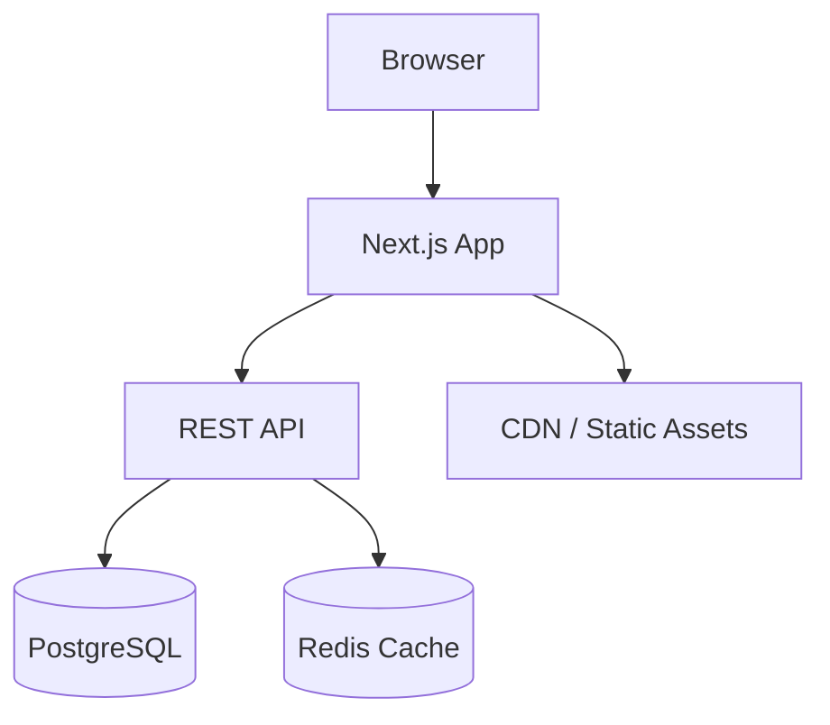
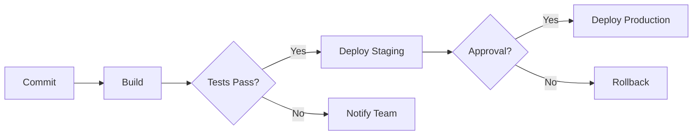
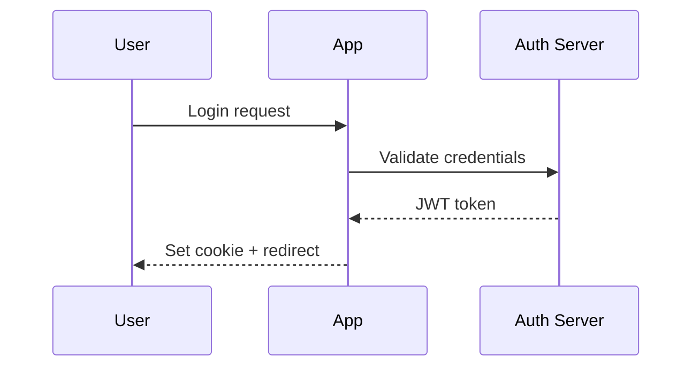
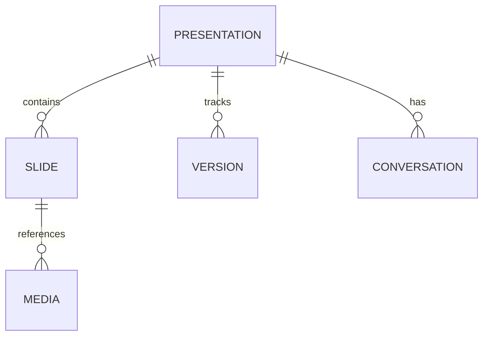

# MarkShow — User Guide

Welcome to MarkShow, a markdown-first presentation editor with an AI co-author.

> This guide is organized by use case. Each section explains what you can do and how to do it.

## Table of Contents

- [Creating a Presentation](#creating-a-presentation)
- [Editing Slides](#editing-slides)
- [Using Images and Media](#using-images-and-media)
- [Custom Styling with CSS](#custom-styling-with-css)
- [Custom Behavior with JavaScript](#custom-behavior-with-javascript)
- [Mermaid Diagrams](#mermaid-diagrams)
- [Charts](#charts)
- [AI Assistant](#ai-assistant)
- [Presenting](#presenting)
- [Managing Presentations](#managing-presentations)
- [Configuration — AI Provider](#configuration--ai-provider)

---

## Creating a Presentation

1. On the **Home** page, click the **+ New Presentation** button.
2. A dialog appears asking for:
   - **Title** (required) — the name of your presentation.
   - **Subtitle** — an optional one-line description shown on the title slide.
   - **Author** — your name, shown on the title slide.
3. Click **Create**. MarkShow generates a two-slide starter deck and opens the editor immediately.

Your presentation is automatically saved as a folder on the filesystem, with the folder name derived from your title (e.g., "Q1 Revenue Report" becomes `q1-revenue-report-a1b2`).

---

## Editing Slides

The Editor page has a **code panel** on the left and a **live preview** on the right.

### Writing slides in Marp markdown

MarkShow uses [Marp](https://marp.app/) format. Slides are separated by `---` on its own line.

```markdown
---
marp: true
theme: default
paginate: true
---

# First Slide Title

Some content here.

---

## Second Slide

- Bullet point
- Another point
```

The preview updates automatically as you type (with a short debounce).

### Tabs in the code panel

The code panel has five tabs:

| Tab | Purpose |
|-----|---------|
| **Markdown** | Your slide content in Marp format |
| **CSS** | Custom styles applied to your slides |
| **JS** | Custom JavaScript executed in the slides |
| **Media** | Upload and manage images and media files |
| **Config** | Edit title, subtitle, author, theme |

---

## Using Images and Media

### Uploading files

1. Switch to the **Media** tab.
2. Drag and drop images onto the drop zone, or click it to browse files.
3. Accepted formats: PNG, JPG, GIF, SVG, WebP, MP4, WebM, PDF.

### Referencing images in slides

Each uploaded file shows a **copy** button (clipboard icon). Click it to copy the markdown reference, then paste it into your markdown:

```markdown

```

The `./` prefix means "in the same folder as the presentation." MarkShow handles the path resolution automatically — images display correctly in both the editor preview and during presentation.

### Managing files

- **Rename**: click the pencil icon next to a filename, edit it, and press Enter.
- **Preview**: click a thumbnail to see a full-size preview in a popup.
- **Delete**: click the trash icon to remove a file.

### Image sizing

Images automatically resize to fill the available space in each slide. If your slide has a heading and an image, the image occupies the area below the heading. If the slide contains only an image, it fills the entire slide.

---

## Custom Styling with CSS

Switch to the **CSS** tab to write custom styles that are applied to all slides.

### Examples

**Change the background color of all slides:**
```css
section {
  background: #1a1a2e;
  color: #eee;
}
```

**Style specific headings:**
```css
section h1 {
  color: #A855F7;
  text-transform: uppercase;
}
```

**Add a background image to a specific slide using Marp directives:**

In your markdown, add a comment directive before the slide:
```markdown
---

<!-- _backgroundColor: #0d1117 -->
<!-- _color: white -->

## Dark Slide

This slide has a custom dark background.
```

**Style a particular slide by its number:**
```css
section:nth-of-type(3) {
  background: linear-gradient(135deg, #667eea, #764ba2);
  color: white;
}
```

### How it works

The CSS you write in the CSS tab is injected after Marp's built-in theme CSS. This means you can override any default style. Your CSS is saved in a `styles.css` file within the presentation folder and is automatically applied in both the editor preview and the fullscreen presentation.

---

## Custom Behavior with JavaScript

Switch to the **JS** tab to write JavaScript that executes within the slide iframe.

### Examples

**Add a live clock to slides:**
```javascript
const clock = document.createElement('div');
clock.style.cssText = 'position:fixed;top:10px;right:10px;font-size:14px;color:#888;';
document.body.appendChild(clock);
setInterval(() => {
  clock.textContent = new Date().toLocaleTimeString();
}, 1000);
```

**Add click-to-advance behavior:**
```javascript
document.addEventListener('click', () => {
  const next = document.querySelector('section:target + section');
  if (next) next.scrollIntoView({ behavior: 'smooth' });
});
```

### How it works

The JavaScript you write in the JS tab is injected as a `<script>` block at the end of the rendered HTML document. It runs inside the slide iframe, so it has access to the slide DOM but is sandboxed from the main MarkShow application.

Your code is saved in a `scripts.js` file within the presentation folder and is applied in both the editor preview and the fullscreen presentation.

### Important notes

- Scripts run inside a sandboxed iframe — they cannot access MarkShow's UI or other pages.
- Changes in the JS tab trigger a live preview update, just like markdown and CSS changes.
- Errors in your JavaScript are visible in the browser's developer console (inside the iframe).

---

## Mermaid Diagrams

MarkShow supports Mermaid diagrams natively. Use a fenced code block with the `mermaid` language tag and the diagram renders directly in your slide — both in the editor preview and during presentation.

### Use case: System architecture

Show how components connect in an architecture slide:

````markdown
---

## System Architecture


````

### Use case: Process flow

Explain a workflow or decision process:

````markdown
---

## Deployment Pipeline


````

### Use case: Sequence diagram

Illustrate how components interact over time:

````markdown
---

## Authentication Flow


````

### Use case: Entity-relationship diagram

Document data models:

````markdown
---

## Data Model


````

### Supported diagram types

All Mermaid types work: **flowcharts** (`graph`), **sequence diagrams**, **class diagrams**, **state diagrams**, **entity-relationship**, **Gantt charts**, **pie charts**, **git graphs**, **mindmaps**, and **timeline**. See the [Mermaid documentation](https://mermaid.js.org/) for full syntax.

### Sizing and theme

- Diagrams render with a **dark theme** matching MarkShow's design
- SVGs **scale proportionally** to fit available slide space
- If a slide has a heading + diagram, the diagram fills the area below the heading
- For best results, keep diagrams focused — very complex diagrams may become hard to read at presentation scale

---

## Charts

You can include data charts using fenced code blocks with the `chart` language tag. The content must be a valid Chart.js configuration object in JSON format.

### Example — Bar chart

````markdown
---

## Sales by Quarter

```chart
{
  "type": "bar",
  "data": {
    "labels": ["Q1", "Q2", "Q3", "Q4"],
    "datasets": [{
      "label": "Revenue (M€)",
      "data": [12, 19, 8, 15],
      "backgroundColor": ["#A855F7", "#EC4899", "#8B5CF6", "#D946EF"]
    }]
  }
}
```
````

### Example — Line chart

````markdown
```chart
{
  "type": "line",
  "data": {
    "labels": ["Jan", "Feb", "Mar", "Apr", "May"],
    "datasets": [{
      "label": "Users",
      "data": [100, 250, 400, 350, 600],
      "borderColor": "#A855F7",
      "tension": 0.3
    }]
  },
  "options": {
    "scales": {
      "y": { "beginAtZero": true }
    }
  }
}
```
````

### Supported chart types

All Chart.js chart types are supported: bar, line, pie, doughnut, radar, polar area, bubble, and scatter. Charts automatically use dark-themed colors for labels and grid lines. See the [Chart.js documentation](https://www.chartjs.org/docs/) for configuration options.

---

## AI Assistant

The editor includes a built-in AI assistant that can help you create, modify, and improve your slides.

### Opening the assistant

Click the **sparkles icon** (✨) on the left of the editor tabs. The assistant panel slides open and the layout adjusts to make room:
- **With assistant open**: 20% assistant / 40% code / 40% preview
- **With assistant closed**: 50% code / 50% preview

### Using the assistant

1. Type your request in the input field at the bottom of the panel (e.g., "Add a slide about microservices architecture").
2. Press **Enter** or click the **send** button.
3. The assistant's response appears as a chat bubble. When AI integration is active, the assistant can generate or modify your Marp markdown directly.

### Closing the assistant

Click the **close icon** in the assistant panel header. The layout returns to the 50/50 code/preview split. Your conversation history is preserved.

### Notes

- The conversation history is saved per presentation and persists between sessions.
- The AI provider is fully configurable — see [Configuration — AI Provider](#configuration--ai-provider) below.

---

## Presenting

1. In the editor, click the **Present** button in the preview panel header.
2. Or from the Home page, click the **play** icon on a presentation card.

### During presentation

- **Navigate slides**: use left/right arrow keys, or click the chevron buttons on each side.
- **Advance**: press Space to go to the next slide.
- **Fullscreen**: press **F** or click the fullscreen icon in the top control bar.
- **Exit**: press Escape to leave fullscreen or go back to the editor.
- The top control bar shows the current slide number (e.g., "3 / 12").

---

## Managing Presentations

### From the Home page

- **Edit**: click the pencil icon on a card to open the editor.
- **Present**: click the play icon to start the fullscreen presentation.
- **Details**: click the external link icon for the details view.
- **Delete**: click the trash icon. A confirmation dialog asks you to confirm before deleting.

### Editing metadata

In the editor, switch to the **Config** tab to change:
- **Title** — the presentation name shown everywhere.
- **Subtitle** — the one-line description.
- **Author** — shown on the title slide.
- **Theme** — the Marp theme name (e.g., "default", "gaia", "uncover").

Click **Save** to apply changes. The title update is reflected immediately in the top bar and on the Home page.

---

## Configuration — AI Provider

MarkShow's AI assistant uses an **OpenAI-compatible API**, which means it works with many AI providers out of the box. Configuration is done via environment variables in your `.env` file.

### Environment variables

| Variable | Description | Default |
|---|---|---|
| `AI_API_URL` | Base URL of the AI API | `http://localhost:11434/v1` (Ollama) |
| `AI_MODEL` | Model name to use | `gemma4` |
| `AI_API_KEY` | API key (if required by the provider) | *(empty)* |
| `AI_SYSTEM_PROMPT` | System prompt for the AI assistant | Pre-configured for Marp editing |

### Using with Ollama (default)

1. Install [Ollama](https://ollama.ai) and pull a model: `ollama pull gemma4`
2. Ollama runs at `localhost:11434` by default — no `.env` changes needed.
3. Start MarkShow — the assistant connects to your local Ollama instance.

### Using with Claude (Anthropic)

```env
AI_API_URL=https://api.anthropic.com/v1
AI_API_KEY=sk-ant-...
AI_MODEL=claude-sonnet-4-20250514
```

### Using with OpenAI

```env
AI_API_URL=https://api.openai.com/v1
AI_API_KEY=sk-...
AI_MODEL=gpt-4o
```

### Using with any OpenAI-compatible provider

Any API that implements the `/v1/chat/completions` endpoint works. Set `AI_API_URL` to its base URL and `AI_MODEL` to the model name.
